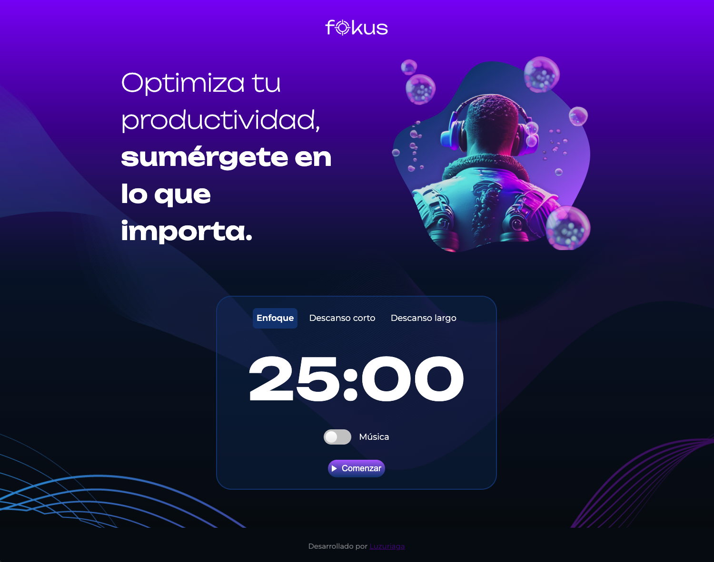

# fokus

Pequeño proyecto web estático que contiene una página principal (`index.html`), estilos (`styles.css`) y lógica en JavaScript (`script.js`). Incluye carpetas de recursos para imágenes y sonidos.



## Descripción

`fokus` es una aplicación/juego web ligera construida con HTML, CSS y JavaScript. Está pensada para ejecutarse directamente en el navegador sin backend.

## Estructura del proyecto

- `index.html` — entrada principal de la aplicación.
- `script.js` — lógica de la aplicación.
- `styles.css` — estilos.
- `imagenes/` — recursos gráficos (sprites, fondos, iconos).
- `sonidos/` — efectos y música.

## Requisitos

- Un navegador moderno (Chrome, Firefox, Safari, Edge).
- Para servir localmente (opcional) una manera rápida es usar Python 3 o una extensión de VS Code (Live Server).

## Cómo ejecutar

Opción 1 — Abrir el archivo directamente:

```bash
# En macOS puedes abrir con el navegador por defecto
open index.html
```

Opción 2 — Servidor HTTP simple (recomendado para evitar restricciones de CORS con recursos):

```bash
# desde la carpeta del proyecto
python3 -m http.server 8000
# luego abrir http://localhost:8000 en el navegador
```

Opción 3 — Usar Live Server en VS Code:

1. Abrir la carpeta del proyecto en VS Code.
2. Instalar y activar la extensión Live Server.
3. Hacer clic en "Go Live".

## Uso

- Abre la página y sigue las instrucciones en pantalla (o interactúa con los controles visibles). Los recursos multimedia (imágenes/sonidos) se cargan desde las carpetas `imagenes/` y `sonidos/`.

## Buenas prácticas y pruebas rápidas

- Si añades imágenes o sonidos, mantenlos en las carpetas `imagenes/` y `sonidos/` respectivamente.
- Comprueba la consola del navegador para mensajes de error (DevTools → Console).

## Cómo contribuir

1. Haz un fork del repositorio y crea una rama con un nombre descriptivo (`feature/nueva-cosa`, `fix/bug-corto`).
2. Añade cambios y pruebas pequeñas si aplica.
3. Abre un pull request describiendo los cambios.

Convenciones sugeridas:
- Mensajes de commit en inglés/español, formato: `tipo: breve descripción` (ej.: `fix: corregir carga de audio`).


## Desarrollado por Lucero Uzuriaga
✨ Portafolio creado con pasión y dedicación.

## Licencia

Este proyecto está bajo la licencia MIT.
Consulta el archivo LICENSE para más detalles.


